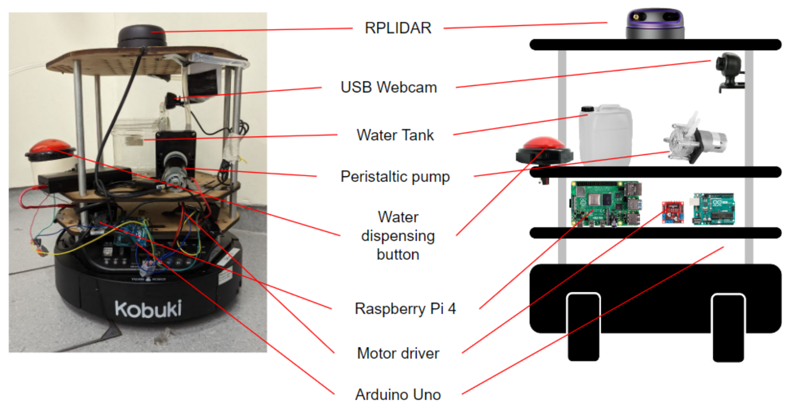
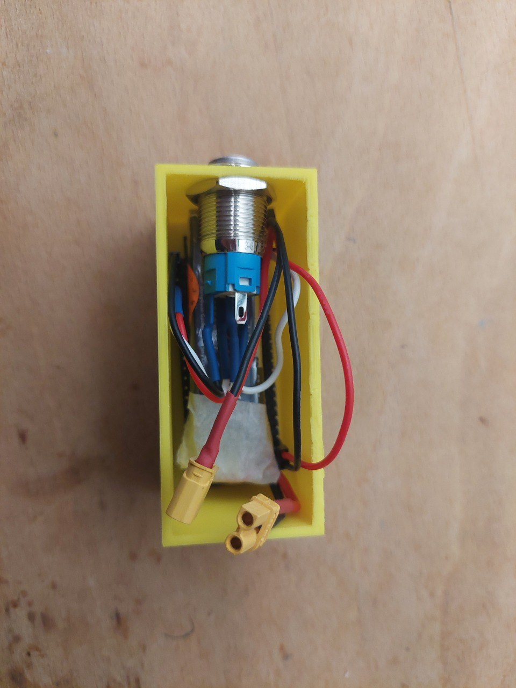
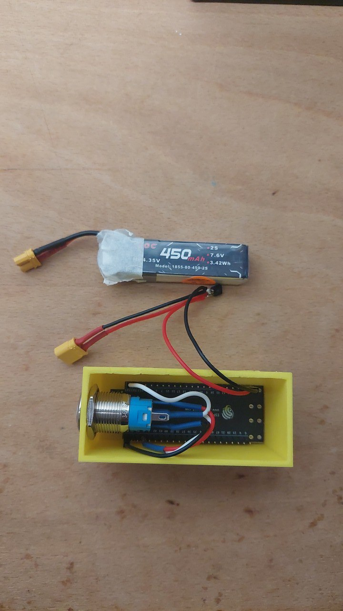
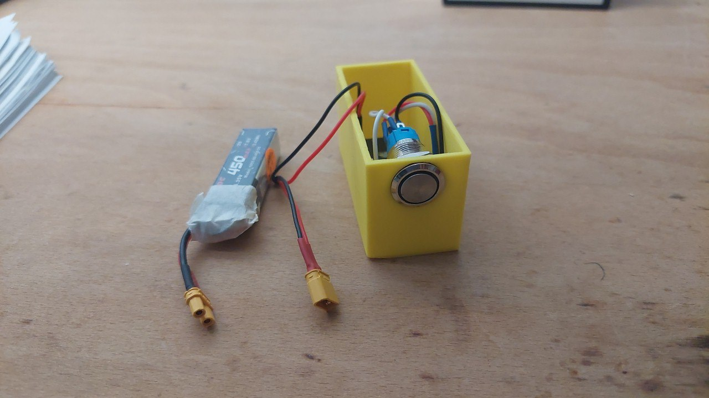
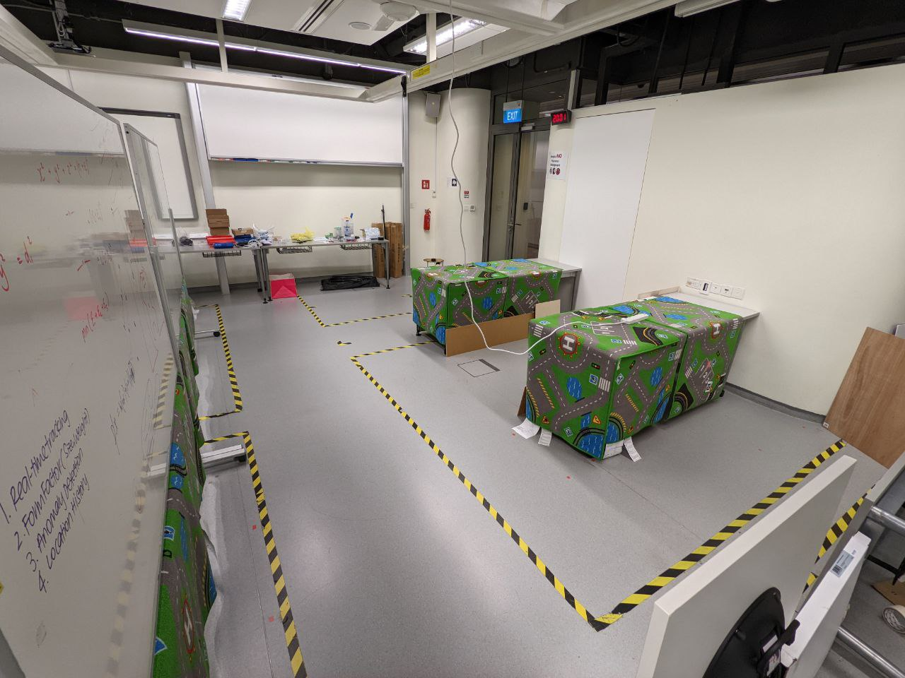
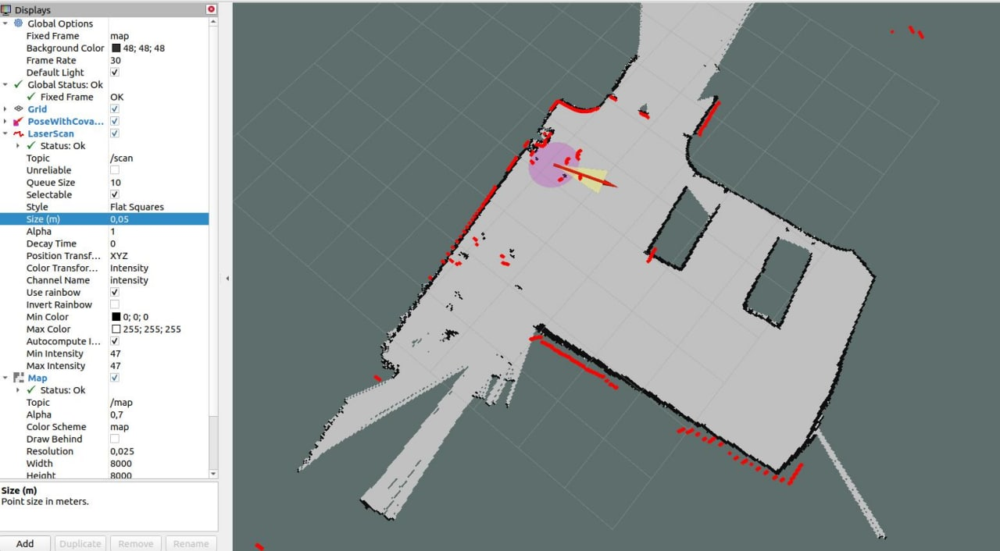
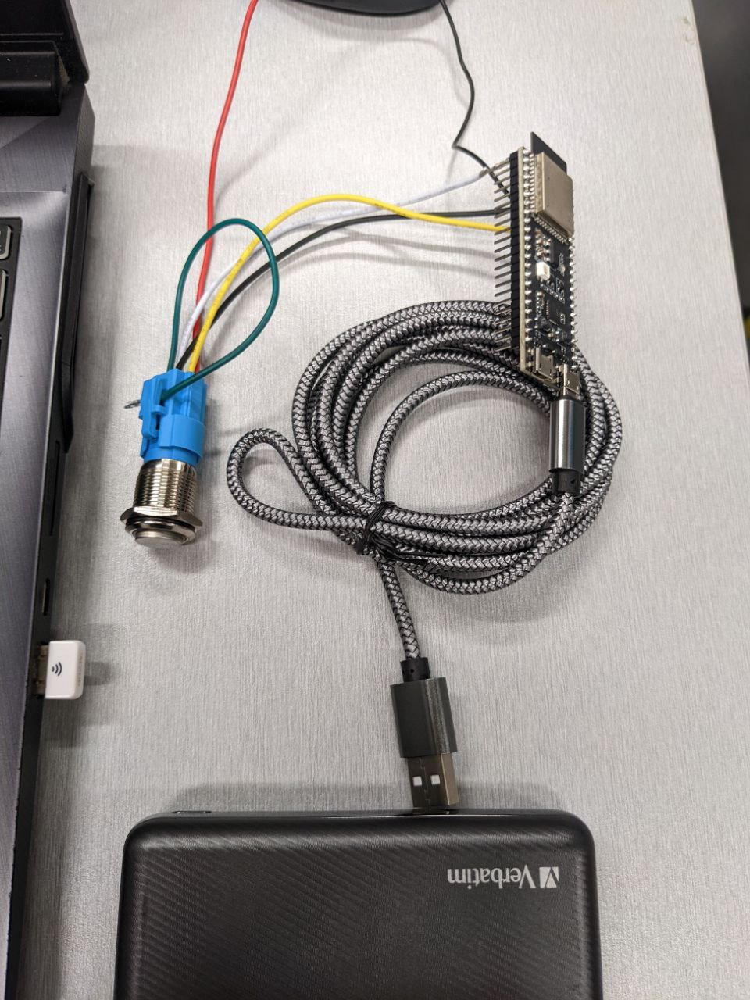
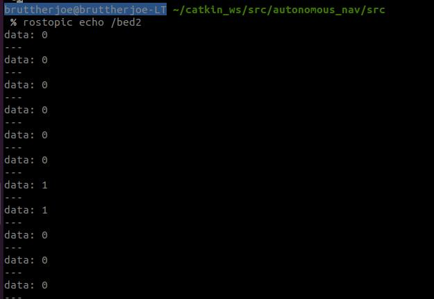
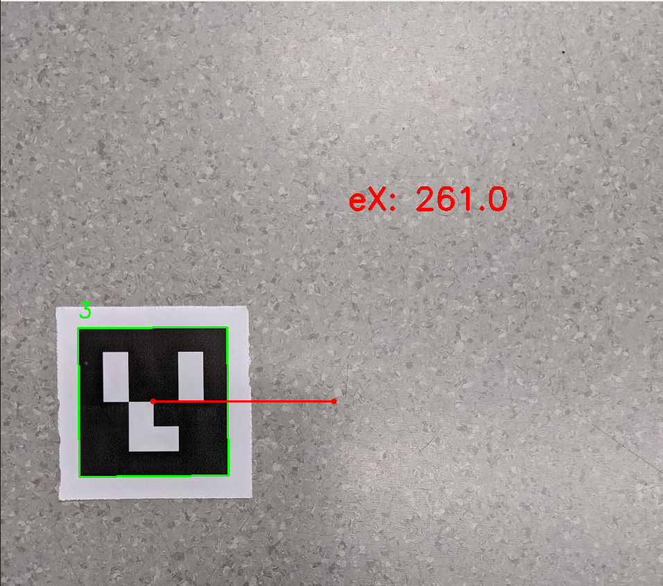
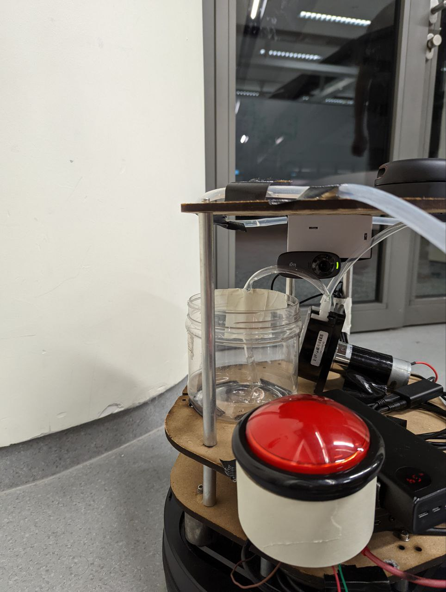

<p align="center">
  
</p>


## Background

The onset of the COVID-19 pandemic in 2020 has led to an immense strain on nurses both in Singapore and abroad. Nurses in Singapore are now resigning at record numbers due to various reasons including the long working hours and few breaks. This has left a severe shortage of nurses in Singapore’s hospitals. 

Nurses are essential to every healthcare system and a shortage would negatively impact the country’s security. They have a myriad of responsibilities involving attending to patients, assisting doctors in their work. One task that nurses are responsible for is delivering water to patients in hospital beds. This happens multiple times a day for each patient, taking up significant time out of the nurses’ busy schedule. Since this is a relatively straightforward task, we propose to use the WODER to help serve patients with water whenever the patients call for it. We hope that this can reduce the workload of nurses, and allow them to spend the time doing other, more important or essential tasks.


## How It Works

The water dispenser will be mounted on Wodewater (WODER), and water call buttons will be placed at each hospital bed. Each water call button will be associated with the position of the hospital bed on the map. When the water call button is pressed, WODER will travel to the foot of the hospital bed. After that, it will travel along the side of the bed and search for the ArUco marker on the side of the bed to position itself exactly where the patient wants it to stop. These markers are designed to be dynamic, and the patient would have the choice of where they would want to place them along the bed such that they would have better reach or access to the water dispensed by WODER

To send WODER away, the patient will need to depress the button at their bed again to unlatch the button. Buttons have an inbuilt LED to signify whether they are latched or not. By default, WODER will go back to its home / docking station where the nurses will be able to fill WODER up if water supply in the water tank is low, otherwise if a patient calls WODER while it is moving, it will cancel its original plan, then go to that bed.


## System Architecture

WODER is equipped with a RPLIDAR, Raspberry Pi 4, and a webcam. The Raspberry Pi is connected to the Kobuki Turtlebot, webcam, and RPLIDAR via USB. ROS Master will run on the Raspberry Pi. 

All packages were compiled on Ubuntu 20.04 on the noetic distribution. 

The water dispenser is also mounted on WODER, consisting of L298N motor driver, button, peristaltic water pump, water tank and Arduino Uno. 

The water call buttons are enclosed in a 3D-printed casing, equipped with a latching button, LiPo battery and ESP32 microcontroller.


#### WODER components



#### Water Call Button

<p align="middle">
  
   
</p>

<p align="center">
  
</p>


## Approach


The system is capable of running itself on its own without a laptop when everything is powered up, as `crontab` runs a shell script that runs the `wodewater.launch` file as well as the python scripts for WODER to work on startup. 

For developer level access and visualisation of the localisation algorithm in real time, the SSH username and password of the RPI will be needed. 

A hospital ward environment was recreated in a classroom with two tables to represent the two beds. Carpets were draped over surfaces to successfully replicate the walls and beds for the Lidar detection purposes.


<p align="center">
  
</p>


1. #### Mapping the ward

   WODER will first have to construct a map of the hospital ward using a LIDAR attached to it. This is only done once during set up using `teleop_twist` where the robot will be driven around its environment. Mapping of the area is done using `gmapping`. The `gmapping` algorithm is based on a particle filter pairing algorithm, Rao–Blackwellized particle filter (RBPF) to predict the state transition function to create a 2-D occupancy grid map from laser and pose data collected by WODER.

   <p align="center">
     
   </p>

2. #### Saving the beds and home positions

   Poses (consisting of XYZ position and XYZW orientation) on the map corresponding to the location of the hospital beds, and WODE’s home position will be noted by moving the WODER via `keyboard_teleop`. The pose coordinates are passed into a python file to save these locations.

3. #### Water call buttons

   The ESP32 constantly publishes a `std_msgs/msg Int8` message into the ROS topics `/bed1` and `/bed2` (only 2 beds were used for the purposes of the demo) using `rosserial` over local WiFi. If the button is latched, it will publish a “1”. Otherwise, it will publish a “0”. A subscriber will listen to these topics by use of a custom written python script. The int8 message will constantly publish either a “0” or a “1”. Upon receiving a “1” over any `/bed` topics, the python script will send a command to the `move_base` action client to move it to the respective bed. If “0” is received, the script will send a command to `move_base` to move it to home position. Commands will be blocked from sending when the robot is in motion.

<p align="middle">
  
   
</p>


4. #### Localisation and Navigation

   After receiving the message from the water call button, WODER carries out waypoint navigation to reach the desired bed location using the `move_base` action client. Once the goal has been reached, a callback function will be initiated as WODER calls another function from another python script for the final alignment before exiting the main loop of the code.

5. #### Final Alignment

   Video stream from the USB webcam is processed using OpenCV to look for the Aruco marker using the `aruco` module. A 4X4_50 Aruco marker, approximately 5x5cm, was printed on paper and pasted along the side of the bed. The code uses the relative position of the center of the marker to the center of the image frame to generate movement instructions.

<p align="center">
  
</p>

It publishes `geometry_msgs/msg` Twist messages into the `/cmd_vel_mux/input/navi` ROS topic. If the center of the aruco marker is not within the center of the frame, it will publish a message to move WODER forward slowly. Once the marker is in position, the publisher node is shut down.

6. #### Water Dispenser

To dispense water, the patient presses the water dispensing button until it has dispensed the desired amount. The Arduino UNO reads the button state, and powers the peristaltic pump while the button is depressed. To prevent spillage, the dispenser will stop once the water dispensing button is released. Once the patient has received his water, they will release the water call button to release WODER to return back to home or proceed to the next bed.

<p align="center">
  
</p>


## Results

```
include video here
```

In the video, WODER starts off from the home position, before being sent by the patient in bed 1, followed by bed 2, and then returning back to home. At each bed, WODER stops on the right side of the foot of the bed before initiating the final alignment sequence. After reaching the Aruco marker, WODER stops for the patient to dispense water before moving on to the next position


30.119 Intelligent Robotics

Group members :

Lim Yi Shen

Cherie Hu 

Kristabel Lim 

Fong Yu Fan